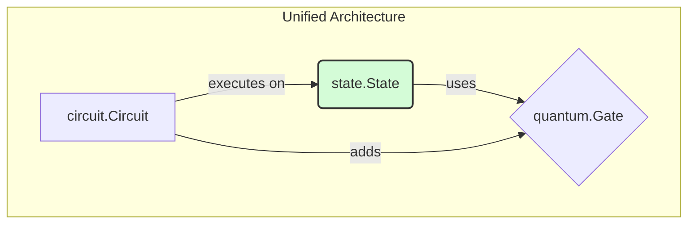

# Quantum Application Architecture Review

This document provides a review of the current architecture of the quantum simulator application.

## 1. High-Level Summary

The application is a quantum simulator written in Go. It provides functionality to create quantum circuits, add gates, and simulate their execution on a quantum state.

The architecture is split into two co-existing styles:

1.  **State Vector-Based (Correct):** The core of the simulator is the `state.State` struct, which correctly represents a multi-qubit system using a state vector. The `circuit.Circuit` executes a sequence of gates on this state vector. This is the correct and powerful way to simulate a quantum computer.

2.  **Individual Qubit-Based (Simplified/Legacy):** The `qubit.Qubit` struct and the `Apply` methods on the `gates` seem to be part of a simplified, single-qubit model. This model is not capable of handling entanglement and is misleading. It's possible this was an initial design that was later replaced by the state vector approach, but it was never fully removed.

The main simulation flow uses the correct state vector-based approach. A `circuit` is created, gates are added to it, and then the circuit is `Execute`d on a `state.State` object.

## 2. Architectural Diagram (Current)

```mermaid
graph TD
    subgraph "Circuit Execution"
        A[circuit.Circuit] -->|executes on| B(state.State)
        B -->|uses| C{quantum.Gate}
        A -->|adds| C
    end

    subgraph "Individual Qubit Model (Legacy)"
        D[qubit.Qubit]
        E[gates] -->|Apply(Qubit)| D
    end

    style B fill:#d4fcd7,stroke:#333,stroke-width:2px
    style E fill:#fcd4d4,stroke:#333,stroke-width:2px
```

## 3. Architectural Issues

### 3.1. Dual Architecture

The presence of two architectures is confusing. A developer using the library might be tempted to use the individual `Qubit` objects and the `Apply` methods on the gates, which would lead to incorrect simulations for any non-trivial circuit. This makes the library's API misleading and error-prone.

### 3.2. Inadequate `Gate` Interface

The `quantum.Gate` interface with its `Apply(Qubit)` method is not suitable for a general-purpose quantum simulator. It only works for single-qubit gates and forces multi-qubit gates to have out-of-band methods (e.g., `CNOTGate.ApplyControlled`). The `state.ApplyGate` method, which takes the gate and target qubits, is the correct approach, and it doesn't rely on the `Gate.Apply` method.

### 3.3. Misleading `gates` Implementation

The `Apply` methods in the `gates` package are misleading. They should either be removed or their documentation should clearly state that they are for single-qubit operations only and that for circuit simulation, the `state.ApplyGate` method should be used. The comment in the CNOT gate about not handling entanglement (`// This simplified implementation won't handle entanglement correctly`) is a symptom of this problem.

### 3.4. Inconsistent Gate Validation

The logic for validating gate matrices is duplicated. The `gateQubitCount` function in `circuit.go` and the validation logic in `state.applySingleQubitGate` and `state.applyTwoQubitGate` are not consolidated.

## 4. Proposed Architectural Refactoring

To address these issues, the following refactoring is proposed to unify the architecture and make the API clearer and less error-prone.

### 4.1. Proposed Architectural Diagram



### 4.2. Implementation Steps

1.  **Deprecate the Individual Qubit Model:**
    *   Mark the `qubit.Qubit` struct as deprecated.
    *   Add documentation to the `qubit` package explaining that `state.State` should be used instead.

2.  **Refactor the `Gate` interface:**
    *   Remove the `Apply(Qubit) error` method from the `quantum.Gate` interface. The interface should only contain `Name() string` and `Matrix() [][]complex128`.

3.  **Clean up the `gates` package:**
    *   Remove the `Apply` methods from all gate structs.
    *   Remove any special-cased methods like `ApplyControlled` and `ApplySwap`. The logic in `state.State` already handles multi-qubit gates generically using their matrix representation.

4.  **Consolidate Gate Validation:**
    *   Move the `gateQubitCount` function from `circuit.go` to a central package (e.g., `quantum`).
    *   Use this function in `circuit.AddGate` and `state.ApplyGate` to validate gates, ensuring a single source of truth for gate validation logic.

By implementing these changes, the architecture will be simplified, the API will be less ambiguous, and the risk of incorrect usage will be significantly reduced.
